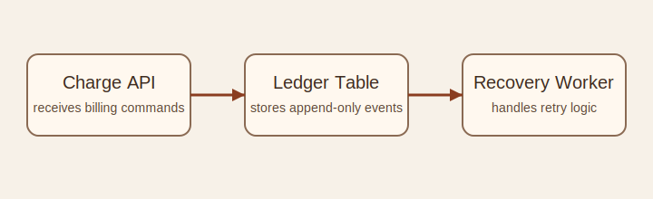

# Billing System Design

## Purpose

The billing service records charge attempts, payment outcomes, and recovery actions for subscription events.

It is responsible for:

- receiving charge requests from upstream product flows
- recording immutable financial events
- exposing billing state to internal consumers

## Core Components

- `API layer`: receives billing commands and exposes internal read endpoints
- `ledger table`: stores append-only charge and recovery events
- `reconciliation worker`: derives account state from ledger history
- `notification integration`: emits billing outcome events to dependent systems

## Data Flow

1. A product workflow requests a charge attempt.
2. The billing API validates the request and creates a ledger event.
3. The payment processor responds with success, failure, or pending state.
4. The result is persisted as a new ledger event.
5. Recovery workers evaluate failed attempts and schedule follow-up actions.

## Boundaries

- This service owns charge-event history.
- It does not own customer profile data.
- It does not own subscription-plan definition.

## Operational Notes

- Writes should be append-only.
- Derived account balances should be rebuildable from ledger history.
- Recovery workflows should remain idempotent.
