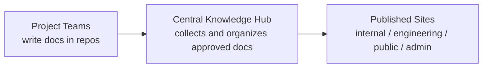
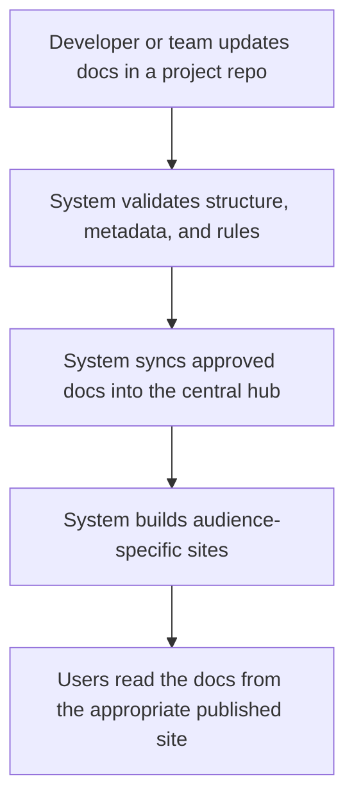
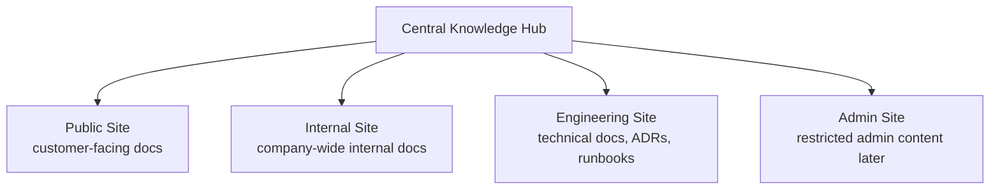

# Executive System View

## Purpose

This document explains the `Alfafaa Knowledge Hub` in a simpler way for owners, managers, and non-technical stakeholders.

It focuses on:

- what the system is
- how it works from writing to publishing
- what is already working
- what still needs to happen before full production use

## 1. What This System Is

The knowledge hub is a centralized company documentation system.

The main idea is simple:

- teams write documentation inside their own project repositories
- the system automatically collects the right documents into one central hub
- the hub then publishes different versions for different audiences

This gives the company:

- one place to discover knowledge
- less duplicate documentation
- safer publishing
- cleaner internal and external access separation

## 2. Simple System Picture

## 3. How It Works In Plain Language

Think of the system like this:

- each team writes documents near the code and project they belong to
- the hub decides which documents should stay local, which should be indexed, and which should be published
- the publishing layer turns those documents into browseable websites

That means people do not need to manually copy documentation from repo to repo or from repo to website.

## 4. End-To-End Workflow

## 5. The Audience Model

The same knowledge system can serve different audiences safely.

## 6. What Is Already Working

The system is already working as a real MVP, not just as a plan.

Current working capabilities:

- teams can keep docs in project repositories
- docs can be validated automatically
- docs can be routed into the central hub
- audience-specific content can be generated
- Quartz builds real static documentation sites
- rendered sites can be deployed to a staging VPS

Current live staging endpoints:

- internal site: `http://89.167.69.232:8088/`
- engineering site: `http://89.167.69.232:8089/`

## 7. What Problems Were Solved Recently

During staging rollout, a few important issues were discovered and fixed.

### A. Real Site Building

At first, the system prepared Quartz inputs but did not yet produce final static websites.

That was fixed.

Now the system builds actual deployable HTML/CSS/JS sites.

### B. Broken Deep Links

At first, some document URLs opened the home page instead of the document itself.

That routing issue was fixed in the nginx layer.

### C. Placeholder Technical Pages

At first, some engineering pages were only showing index/catalog placeholder content.

That was fixed by changing the sync rules so important engineering docs publish their actual bodies.

## 8. What The Company Gains

This system is designed to create long-term operational benefits:

- developers document where they already work
- management gets a central knowledge system
- technical and non-technical docs can coexist without becoming messy
- internal and public content can be separated cleanly
- future governance and approvals become possible

## 9. What Still Remains

The system is working, but it is still in the staging and hardening phase.

Main remaining work:

- proper domain names instead of raw IP and ports
- HTTPS / TLS
- login and role-based access control
- approval-based publishing for public and admin content
- stronger visual design and navigation polish
- production operations such as rollback, monitoring, and release hygiene

## 10. Recommended Next Phase

The next best business-level step is:

- move from staging URLs to secure internal domains with access control

That is the point where the system starts becoming a real company platform instead of only a technical prototype.

## 11. One-Sentence Summary

`Alfafaa Knowledge Hub` is now a working centralized documentation pipeline where teams write locally, the system syncs centrally, and audience-specific sites can already be published to staging. 
