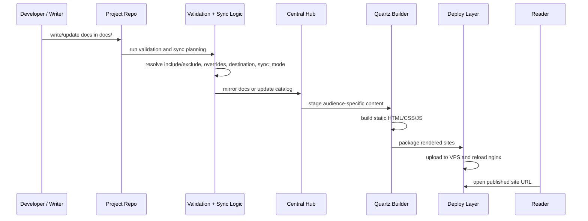
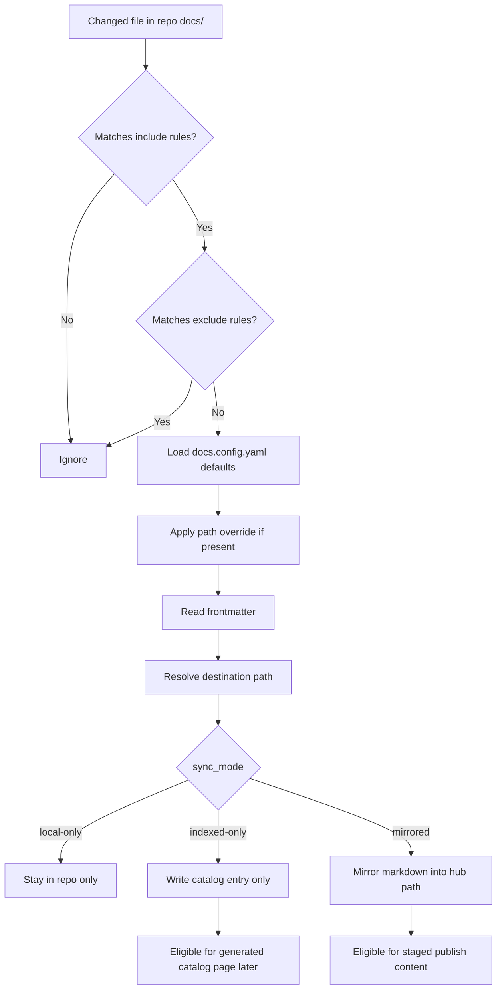
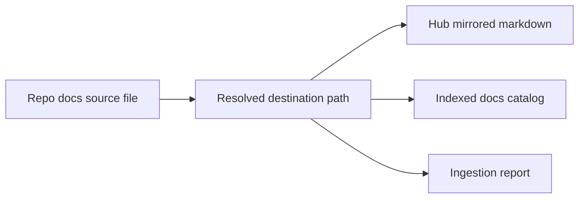
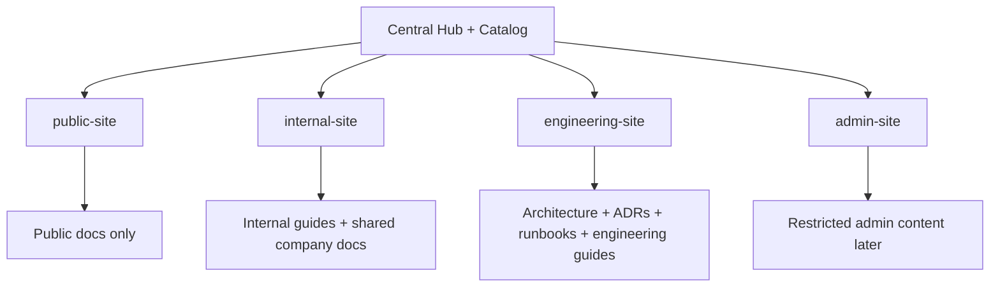
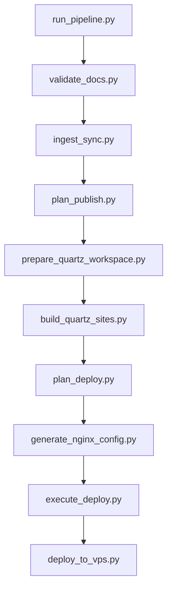
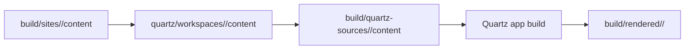
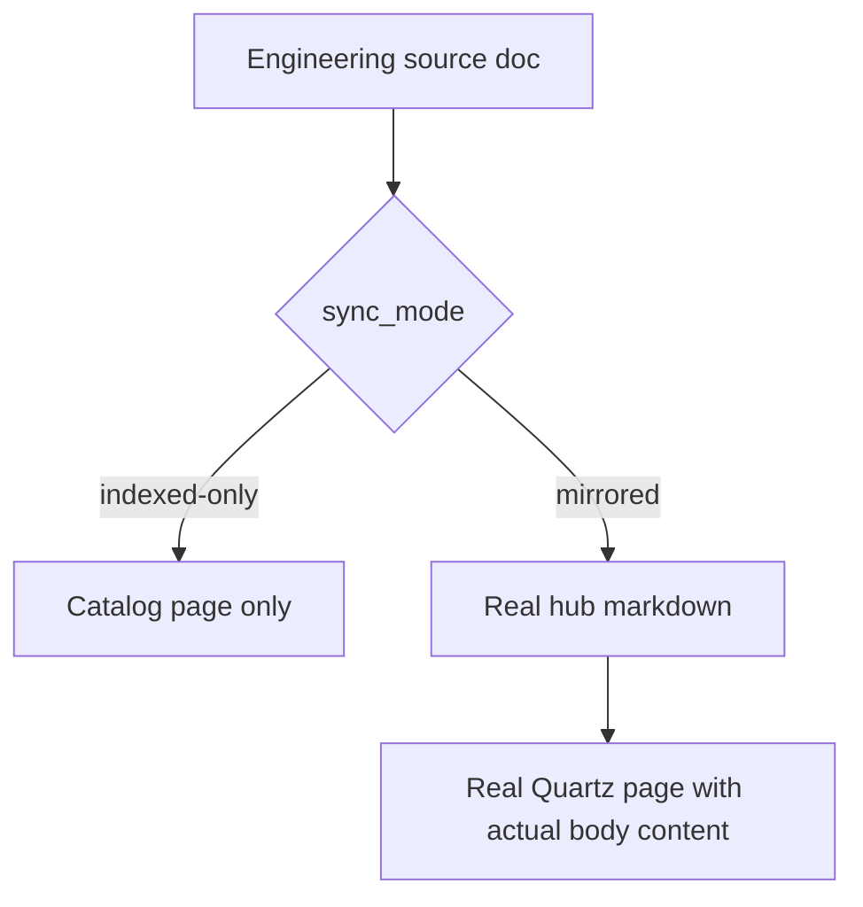
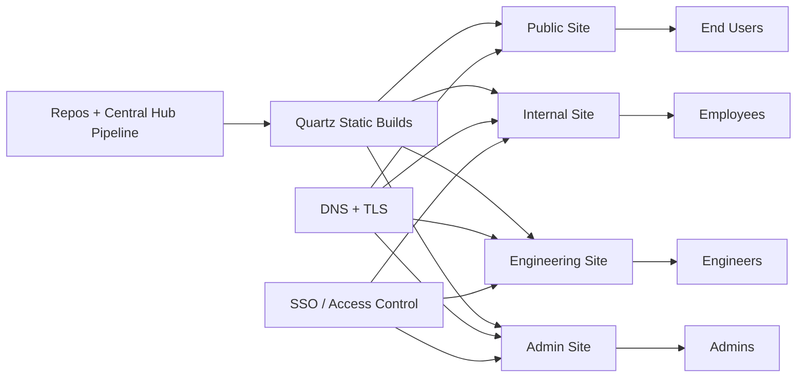

# System Architecture And Workflow Diagrams

## Purpose

This document explains the implemented `Alfafaa Knowledge Hub` system visually.

It covers:

- how documentation starts in project repositories
- how the central hub ingests and classifies docs
- how audience-specific sites are generated
- how staging deployment currently works
- what the final publishing model is intended to become

## 1. End-To-End System Architecture

```mermaid
flowchart LR
    A[Project Repositories<br/>docs/ + docs.config.yaml + frontmatter]
    B[Validation Layer<br/>validate_docs.py]
    C[Sync Resolution Layer<br/>plan_sync.py + sync_lib.py]
    D[Ingestion Layer<br/>ingest_sync.py]
    E[Central Hub Repository<br/>hub/ + indexed-docs-catalog.json]
    F[Publish Planning Layer<br/>plan_publish.py]
    G[Quartz Workspace Layer<br/>prepare_quartz_workspace.py]
    H[Quartz Static Build Layer<br/>build_quartz_sites.py + quartz/app]
    I[Rendered Static Sites<br/>build/rendered/public-site<br/>internal-site<br/>engineering-site<br/>admin-site]
    J[Deploy Planning + Packaging<br/>plan_deploy.py + execute_deploy.py]
    K[Remote Delivery<br/>deploy_via_ssh.py + nginx]
    L[Published Endpoints<br/>public / internal / engineering / admin]

    A --> B
    B --> C
    C --> D
    D --> E
    E --> F
    F --> G
    G --> H
    H --> I
    I --> J
    J --> K
    K --> L
```



## 2. Authoring To Publishing Flow

Analogy:

- project repos are the kitchens
- the hub is the warehouse and dispatch center
- Quartz is the showroom
- nginx/VPS is the delivery counter



## 3. Repo-Level Sync Decision Flow

This is the core policy engine for each changed document.



## 4. Central Hub Ingestion Model



Notes:

- `mirrored` docs create a real markdown file inside `hub/`
- `indexed-only` docs create only a catalog entry
- both paths preserve provenance like repo name and source path

## 5. Audience-Specific Publish Model

This is how one aggregated content system becomes multiple reading surfaces.



## 6. Current Implemented Build Pipeline

This reflects the actual current script order in the repo.



## 7. Quartz Rendering Workflow

Quartz is now a real build layer, not just a future placeholder.



Notes:

- `prepare_quartz_workspace.py` builds the Quartz input workspace
- `build_quartz_sites.py` copies content into a clean Quartz source directory
- Quartz outputs real static assets under `build/rendered/<target>/`

## 8. Current Staging Deployment Workflow

This reflects the actual current staging setup on `test-stg`.

```mermaid
flowchart LR
    A[build/rendered/internal-site]
    B[build/rendered/engineering-site]
    C[execute_deploy.py packages]
    D[deploy_via_ssh.py]
    E[/srv/alfafaa-knowledge-hub/internal-site/current]
    F[/srv/alfafaa-knowledge-hub/engineering-site/current]
    G[Generated nginx config]
    H[nginx on staging VPS]
    I[http://89.167.69.232:8088]
    J[http://89.167.69.232:8089]

    A --> C
    B --> C
    C --> D
    D --> E
    D --> F
    G --> H
    E --> H
    F --> H
    H --> I
    H --> J
```

## 9. Current Staging Runtime Topology

```mermaid
flowchart TD
    A[Staging VPS<br/>89.167.69.232]
    A --> B[nginx]
    A --> C[/srv/alfafaa-knowledge-hub]

    B --> D[port 8088<br/>internal-site]
    B --> E[port 8089<br/>engineering-site]

    C --> F[internal-site/current]
    C --> G[engineering-site/current]

    D --> F
    E --> G
```

## 10. Why Some Pages Were Broken Earlier

Two important implementation bugs were discovered during staging.

### A. Route Resolution Bug

Quartz emits many pages as:

- `some-page.html`

But nginx was initially trying only:

- `$uri`
- `$uri/`
- `/index.html`

So nested document URLs incorrectly fell back to the site home page.

### B. Indexed-Only Content Bug

Some engineering docs were configured as:

- `sync_mode: indexed-only`

That made them discoverable, but not publishable as real document pages.

So even after the routing fix, some pages still showed generated catalog entries instead of source content.

## 11. Fixed Runtime Flow

```mermaid
flowchart TD
    A[Engineering doc request]
    A --> B{nginx route lookup}
    B --> C[$uri]
    B --> D[$uri.html]
    B --> E[$uri/]
    B --> F[/index.html fallback]

    D --> G[Correct Quartz page served]
```

And for content:



## 12. Future Production Architecture

The current staging setup is intentionally simple.

The likely production direction is:



## 13. What Remains

The system is already working end-to-end, but production hardening is still ahead.

Remaining next-step areas:

- DNS-backed hostnames
- TLS/HTTPS
- SSO and real RBAC enforcement
- approval-gated publish for `public-site` and `admin-site`
- cleanup of Quartz build warnings
- stronger navigation and branding
- production rollback and monitoring

## 14. Recommended Reading Order

If someone needs to understand the system quickly, read in this order:

1. [docs/implementation-handoff-current-state.md](/media/sibbir/MyDrive/Projects/Office/Alfafaa/knowledge-hub/docs/implementation-handoff-current-state.md)
2. [docs/system-architecture-and-workflow-diagrams.md](/media/sibbir/MyDrive/Projects/Office/Alfafaa/knowledge-hub/docs/system-architecture-and-workflow-diagrams.md)
3. [docs/staging-deployment.md](/media/sibbir/MyDrive/Projects/Office/Alfafaa/knowledge-hub/docs/staging-deployment.md)
4. [docs/quartz-runtime-integration.md](/media/sibbir/MyDrive/Projects/Office/Alfafaa/knowledge-hub/docs/quartz-runtime-integration.md)
